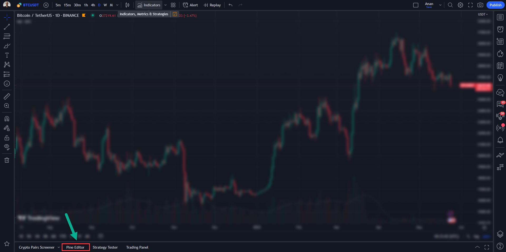

# Pine Script - TradingView Scripts

A collection of scripts created by <a href="https://www.tradingview.com/u/Mohamed3nan/#published-scripts">Mohamed Anan</a> for TradingView using Pine Script Language.

## Scripts

- Updating ASAP..
- [Ultimate Pivot Points [MTF/3in1/4Types/Projection/Alerts]-[Anan]](scripts/Ultimate%20Pivot%20Points)
- [Chande Momentum Oscillator(CMO) & EMA with Divergences](scripts/Chande%20Momentum%20Oscillator(CMO)%20&%20EMA%20with%20Divergences)
- [MFI and RSI wih (R/H Divergence)](scripts/MFI%20and%20RSI%20wih%20(R-H%20Divergence))

## Using scripts

1. By loading scripts from the chart:
   1. Go to the [TradingView Chart](https://www.tradingview.com/chart/)
   2. Click on the “Indicators” button
  
   3. A dialog box will pop up. Write the script name and, when it appears, click on it. It will then be added to your chart.
  

2. By manually adding scripts using Pine Editor:
   1. Go to the [TradingView Chart](https://www.tradingview.com/chart/)
   2. Click on the “Pine Editor” button
  
   3. Paste the script code into the editor box and click on the "Add to chart" button.
  

## About Me

With a strong passion for trading and a solid background in technical analysis, I have spent the past five years actively analyzing and coding on TradingView. Throughout this journey, I have gained a deep understanding of various trading indicators and the fundamentals of technical analysis. This knowledge has enabled me to create scripts that assist traders in their decision-making process. I am dedicated to continuously exploring and refining my skills to provide valuable tools and insights to the trading community. I aim to help fellow traders navigate the markets with confidence and achieve their financial objectives.

## Achievements

I'd like to share some notable achievements that highlight my contributions to the TradingView community:

- I've created a comprehensive collection of open-source and custom indicators, strategies, dashboards, tools, and TradingView solutions using Pine Script programming language. All available for free.
- So far, I've developed +30 scripts that have received +15k boosts from thousands of traders who have greatly benefited from using them.
- You can explore my extensive collection [here](https://www.tradingview.com/u/Mohamed3nan/#published-scripts).

## Contact

If you are a TradingView user, you can contact me via private chats. Simply go to my [TradingView profile](https://www.tradingview.com/u/Mohamed3nan/) and click on "Message". I will get back to you as soon as possible.

You can also find me on:
- LinkedIn: [Mohamed3nan](https://www.linkedin.com/in/Mohamed3nan/)

Additionally, I am available for hire on Upwork and Freelancer.

## Disclaimer

The information and publications are not meant to be, and do not constitute, financial, investment, trading, or other types of advice or recommendations supplied or endorsed by me or TradingView. Read more in the [Terms of Use](https://www.tradingview.com/policies/#disclaimer-regarding-investment-decisions-and-trading).
