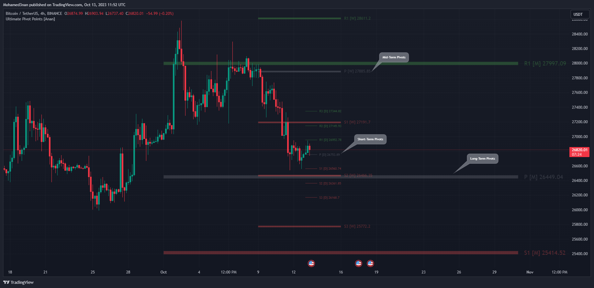
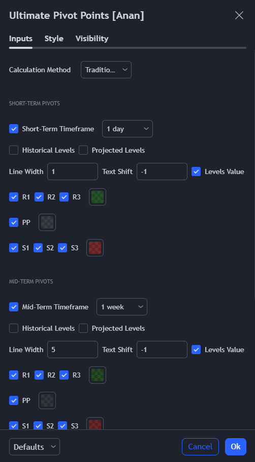

## Overview

| Information         | Details                           |
|---------------------|-----------------------------------|
| Script Name         | Ultimate Pivot Points [MTF/3in1/4Types/Projection/Alerts]-[Anan]|
| Script Privacy      | Protected: Free to use but source code is closed-source|
| TradingView URL     | [Link](https://www.tradingview.com/script/iR4y6rtI-Ultimate-Pivot-Points-MTF-3in1-4Types-Projection-Alerts-Anan/)|

## Description

- 6 Types of Pivot Points (Traditional , Fibonacci , Woodie , Classic, DM, Camarilla).
- Multi-time Frame: you can select Pivots Timeframe (1m, 3m ,5m,15m,30m,45m,1h,2h,3h,4h,1D,1W,1M).
- Three Pivot Points in one chart, I called them and they all have option to show or hide.
- Historical Levels for all periods.
- Projection Pivot Points Levels.
- Each Pivot line have a label and value with period .
- Control with Line Width.
- Control with labels location with Text Shift Factor.
- Separate alerts for every Pivot Points levels.

New features:

- Controlling of (Support / Pivot / Resistance colors).
- New Types of Pivot Points
- Improve visibility and UI.
- Controlling of displaying or hiding any level (Support / Pivot / Resistance).

Thanks QuantNomad for the inspiration.

## Script Screenshots

## Script Settings

